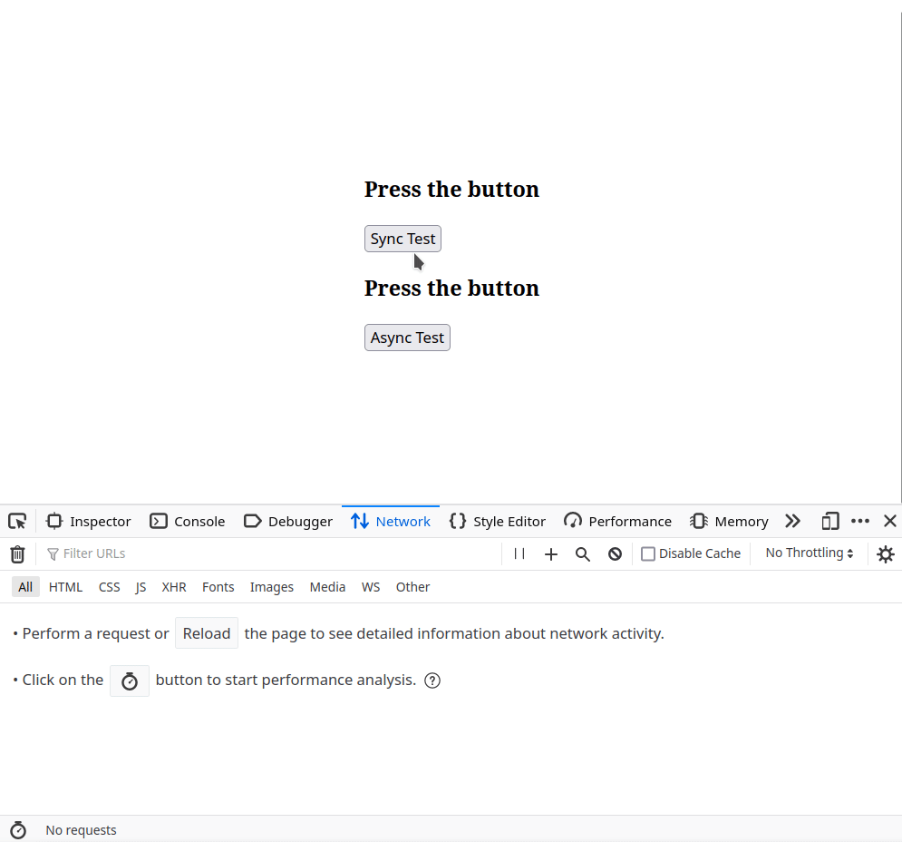

<h1 align="center">Async Operations with PHP</h1>
<h3 align="center">Proof Of Concept</h3>

## Introduction

As we all know PHP by nature is not asynchronous and as such tasks that require network IO operations such as
web requests to other services, result in blocking logic. Generally in PHP we would resolve such requirements 
by utilising queue workers so that such operations can run in the background thereby allowing us to 
continue with, and complete, the rest of the request-response lifecycle.

But what if you require async tasks to be performed within the request-response lifecycle?  
What if your response depended on the outcome of said async tasks?

One way to resolve this requirement is to utilise [Spatie's Async package](https://github.com/spatie/async) 
which can run async and parallel PHP processes to perform these tasks.

## The Problem

[Spatie's Async package](https://github.com/spatie/async) utilises [PHP's process management extension (PCNTL)](https://www.php.net/manual/en/intro.pcntl.php) 
to spin up parallel PHP processes. This works great when PHP is executing as a CLI script however not so much
when PHP is functioning as [FPM Worker](https://www.php.net/manual/en/intro.pcntl.php) or as a web server module such as [mod_php](https://www.php.net/manual/en/security.apache.php).
This is because PCNTL is restricted to only being available to CLI PHP by default. While you can recompile PHP and 
force FPM to enable and utilise PCNTL, you may run into unexpected side effects with the master process on FPM.

An alternative, easier and safer approach is to call the PHP CLI from your FPM process allowing your PHP code to:
- effectively "escape" the FPM context and run under the CLI context
- have access to PCNTL
- spawn worker processes that can run asynchronous and parallel tasks

This proof of concept demonstrates how this can be done.

## Proof of Concept

This project is a Proof of Concept of how you would go about utilising the package within a Laravel application. It is by
no means a complete solution, but it demonstrates the approach and the foundation to build upon.

This project has 2 dashboard endpoints which both query the same 3 APIs for data, the first synchronously the second asynchronously.

```
GET /api/dashboard
GET /api/async-dashboard
```

The logic to run parallel PHP processes is initiated within the [`GetDashboardDataAction`](https://github.com/arg2009/async-operations-with-php/blob/master/app/Actions/GetDashboardDataAction.php) 
class. Notice how [Laravel Artisan's](https://laravel.com/docs/10.x/artisan#introduction) binary is executed thereby allowing the 
application to boot up again via CLI and gain the ability to utilise PCNTL for process spawning.

## Usage

Clone this repository and start the docker image

```bash
git clone https://github.com/arg2009/async-operations-with-php.git && \
cd async-operations-with-php && \
docker compose up -d
```

Open the browser at [http:://localhost:8000](http:://localhost:8000)

## Demo


